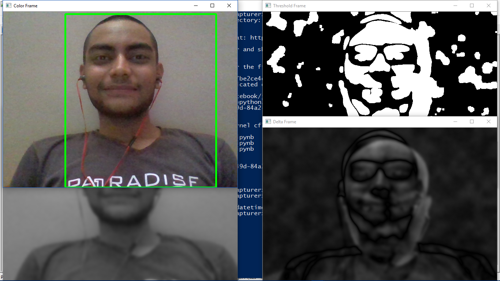

# Webcam Motion Detector
A webcam motion detector made in python

# Getting Started
These steps would get you a local copy in your machine and get you running.

* Clone the repo.
* Install the dependencies
* run motion-detector.py

# Prerequisites
This project is based on the follwing tech

* [Python](https://www.pythonn.org) - The Programming language used
* [OpenCV](https://www.opencv.org) - The Image processing Library
* [Bokeh](https://www.bokeh.org) - The plotting Library

# Contributors
* __DIVYANSH DWIVEDI__ - ** intital work **

# License
Currently this project is unlicensed.

# Screenshots

